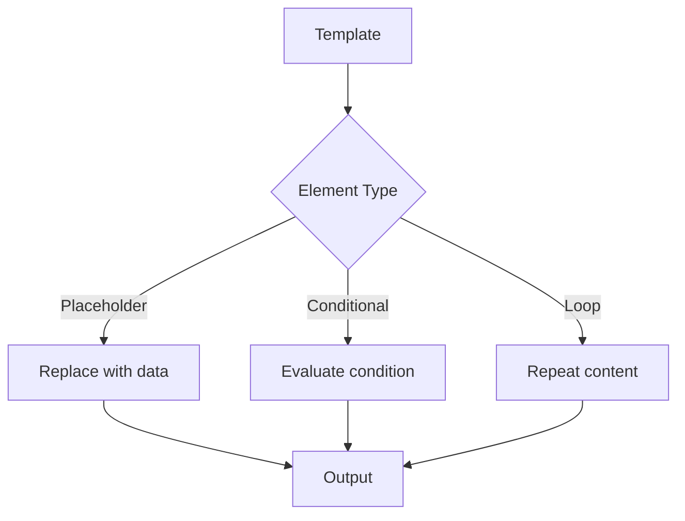

# Templify Documentation Enhancement Plan

## Executive Summary

This document outlines a comprehensive strategy to transform Templify's documentation from good to world-class, making it competitive with top .NET open-source projects.

**Current Status**: Solid technical foundation, needs user-centric improvements
**Goal**: Make Templify the easiest-to-adopt Word templating library in .NET
**Timeline**: 4 weeks of focused effort
**Estimated Effort**: ~140 hours total

---

## Current State Assessment

### What We Have (Strengths) ✅

1. **Comprehensive Technical Documentation**
   - `ARCHITECTURE.md` - 783 lines of design details
   - `PERFORMANCE.md` - Detailed benchmarks with metrics
   - `Examples.md` - 1,930 lines of code samples
   - `CLAUDE.md` - AI-assisted development guide
   - `TODO.md` - Feature roadmap
   - `REFACTORING.md` - Architecture decisions

2. **Well-Structured READMEs**
   - Main README: Project overview, features
   - Library README: API reference (950 lines)
   - Converter README: CLI documentation (629 lines)

3. **Production Credibility**
   - Battle-tested in ViasPro
   - 109 tests, 100% coverage
   - Real performance benchmarks

### What We're Missing (Gaps) ❌

1. **First-Time User Experience**
   - No "Quick Start in 5 Minutes"
   - No visual examples (screenshots, diagrams)
   - Installation steps buried
   - Steep learning curve

2. **Discovery & Navigation**
   - No documentation website
   - No search functionality
   - Hard to find specific topics
   - Long files without TOC

3. **Community Support**
   - No FAQ
   - No troubleshooting guide
   - No contribution guidelines
   - No issue templates

4. **Visual Elements**
   - No architecture diagrams
   - No template before/after examples
   - No comparison tables
   - Text-heavy documentation

5. **Learning Path**
   - No tutorials
   - No progressive difficulty
   - No "cookbook" recipes
   - Assumes too much knowledge

---

## Research: Best Practices from Top .NET Projects

### Patterns from Successful OSS

| Project | Key Success Factor | Lesson for Templify |
|---------|-------------------|---------------------|
| **Dapper** (11k⭐) | Ultra-simple README with immediate code | Lead with working code |
| **Serilog** (6.7k⭐) | Structured getting started, sink ecosystem | Clear configuration examples |
| **MediatR** (10k⭐) | Clear problem statement, minimal concepts | Show value proposition early |
| **AutoMapper** (9.8k⭐) | Configuration API, common scenarios cookbook | Need recipes/cookbook |

### Common Success Patterns

1. **Progressive Disclosure**: Simple first, complexity later
2. **Show, Don't Tell**: Code examples before theory
3. **Visual Aids**: Diagrams using Mermaid
4. **Searchable**: DocFX or documentation sites
5. **Community First**: Clear contribution paths

---

## Implementation Plan

### Phase 1: Quick Wins (Week 1) - HIGH PRIORITY ⚡

**Effort**: 16 hours
**Impact**: Immediate usability improvement
**Status**: ✅ EXECUTING

#### 1.1 Quick Start Guide
**File**: `docs/quick-start.md`

**Content**:
- Install in 1 command
- Your first template (3 steps)
- Working code example
- "What's next?" links

**Success Metric**: New user to first document in < 10 minutes

**Effort**: 3 hours

---

#### 1.2 Mermaid Diagrams in ARCHITECTURE.md
**Files**: `TriasDev.Templify/ARCHITECTURE.md`

**Add Diagrams**:
1. Processing flow (Conditionals → Loops → Placeholders)
2. Visitor pattern architecture
3. Context hierarchy
4. Document walker flow

**Success Metric**: Architecture understandable without reading full text

**Effort**: 4 hours

---

#### 1.3 Comprehensive FAQ
**File**: `docs/FAQ.md`

**Sections**:
- **Getting Started**: Install, first template, basic syntax
- **Features**: Supported features, limitations
- **Performance**: Speed, memory, optimization tips
- **Troubleshooting**: Common errors, solutions
- **Migration**: From OpenXMLTemplates, from manual OpenXML
- **Enterprise**: Security, support, licensing
- **Comparison**: vs other libraries, when to use

**Success Metric**: 50% reduction in "how do I...?" issues

**Effort**: 6 hours

---

#### 1.4 Enhanced README
**File**: `README.md`

**Additions**:
1. **Badges** (top):
   - Build status
   - Test coverage (100%)
   - NuGet version
   - License
   - Downloads

2. **Comparison Table**:
   ```
   | Feature | Manual OpenXML | Templify |
   |---------|---------------|----------|
   | Lines of code | ~200 | ~10 |
   | Template creation | Complex SDT | Simple {{placeholder}} |
   | Maintainability | Low | High |
   ```

3. **Visual Example**: Template → Output (describe what to show)

4. **"Used By" Section**: ViasPro as anchor customer

**Success Metric**: Clearer value proposition, professional appearance

**Effort**: 3 hours

---

### Phase 2: Tutorial Series (Week 1-2) 📚

**Effort**: 12 hours
**Impact**: Builds user confidence, reduces support burden
**Status**: ✅ EXECUTING

#### Tutorial Structure
Each tutorial includes:
- Learning objectives
- Prerequisites
- Step-by-step instructions
- Complete working code
- Template file (describe what to include)
- Expected output
- "What you learned" summary
- Next steps

---

#### 2.1 Tutorial 1: Hello World
**File**: `docs/tutorials/01-hello-world.md`

**Duration**: 30 minutes
**Goal**: Generate your first document

**Content**:
- Install Templify
- Create simple Word template with {{Name}} and {{Date}}
- Write C# code to process it
- Run and verify output

**Learning Outcomes**:
- How placeholders work
- Basic API usage
- Template file structure

**Effort**: 2 hours

---

#### 2.2 Tutorial 2: Invoice Generator
**File**: `docs/tutorials/02-invoice-generator.md`

**Duration**: 1 hour
**Goal**: Build a real-world invoice with line items

**Content**:
- Nested data structures (Company → Address → City)
- Loops for line items
- Number formatting
- Date formatting
- Calculations (subtotal, tax, total)

**Learning Outcomes**:
- Nested data access
- Collections and loops
- Formatting options
- Complex data structures

**Effort**: 3 hours

---

#### 2.3 Tutorial 3: Conditionals & Loops
**File**: `docs/tutorials/03-conditionals-and-loops.md`

**Duration**: 1 hour
**Goal**: Master dynamic content

**Content**:
- Conditional blocks ({{#if}}...{{/if}})
- Else clauses
- Loop variables (@index, @first, @last, @count)
- Nested loops
- Conditionals inside loops

**Learning Outcomes**:
- Conditional logic
- Loop special variables
- Combining features
- Complex scenarios

**Effort**: 3 hours

---

#### 2.4 Tutorial 4: Advanced Features
**File**: `docs/tutorials/04-advanced-features.md`

**Duration**: 1.5 hours
**Goal**: Master advanced scenarios

**Content**:
- Table row loops
- Multi-level nested loops
- Complex conditionals (&&, ||, comparisons)
- Array indexing
- Performance optimization
- Error handling
- Debugging templates

**Learning Outcomes**:
- Tables
- Complex expressions
- Performance best practices
- Production readiness

**Effort**: 4 hours

---

### Phase 3: Professional Documentation Site (Week 2) 🌐

**Effort**: 20 hours
**Impact**: Searchable, professional documentation
**Status**: 🔜 FUTURE

#### 3.1 DocFX Setup
**Tool**: DocFX (Microsoft's documentation generator)
**Hosting**: GitHub Pages (free)

**Why DocFX**:
- Native .NET support
- Auto-generates API docs from XML comments
- Supports custom Markdown articles
- Searchable by default
- Mobile-responsive
- Free hosting

**Setup Steps**:
```bash
# Install DocFX
dotnet tool install -g docfx

# Initialize
docfx init -q

# Configure docfx.json
{
  "metadata": [{
    "src": [{"files": ["**/*.csproj"], "src": "../"}],
    "dest": "api"
  }],
  "build": {
    "content": [
      {"files": ["api/**.yml", "api/index.md"]},
      {"files": ["**.md"]}
    ],
    "dest": "_site",
    "template": ["default", "modern"]
  }
}

# Build
docfx build

# Local preview
docfx serve

# Deploy to GitHub Pages (via GitHub Actions)
```

**Directory Structure**:
```
docs/
├── index.md                    # Landing page
├── quick-start.md             # 5-minute guide
├── tutorials/
│   ├── README.md              # Tutorial index
│   ├── 01-hello-world.md
│   ├── 02-invoice-generator.md
│   ├── 03-conditionals-and-loops.md
│   └── 04-advanced-features.md
├── guides/
│   ├── installation.md
│   ├── troubleshooting.md
│   ├── migration.md
│   ├── performance.md
│   └── best-practices.md
├── examples/
│   ├── gallery.md             # Example showcase
│   ├── invoice.md
│   ├── contract.md
│   ├── report.md
│   └── certificate.md
├── api/
│   └── (auto-generated from XML docs)
├── contributing/
│   ├── setup.md
│   ├── testing.md
│   ├── architecture.md
│   └── guidelines.md
└── FAQ.md
```

**GitHub Actions Workflow** (`.github/workflows/docs.yml`):
```yaml
name: Documentation

on:
  push:
    branches: [main]
  pull_request:
    branches: [main]

jobs:
  build-docs:
    runs-on: ubuntu-latest
    steps:
      - uses: actions/checkout@v3

      - name: Setup .NET
        uses: actions/setup-dotnet@v3
        with:
          dotnet-version: '9.0.x'

      - name: Setup DocFX
        run: dotnet tool install -g docfx

      - name: Build Documentation
        run: docfx docs/docfx.json

      - name: Deploy to GitHub Pages
        if: github.ref == 'refs/heads/main'
        uses: peaceiris/actions-gh-pages@v3
        with:
          github_token: ${{ secrets.GITHUB_TOKEN }}
          publish_dir: ./docs/_site
```

**Effort**: 12 hours

---

#### 3.2 API Documentation Enhancement
**Task**: Ensure all public APIs have XML documentation

**Files to enhance**:
- `DocumentTemplateProcessor.cs`
- All Visitor classes
- `EvaluationContext.cs`
- `PropertyPathResolver.cs`
- Configuration classes

**XML Doc Format**:
```csharp
/// <summary>
/// Processes Word document templates by replacing placeholders with data.
/// </summary>
/// <param name="templateStream">The template document stream.</param>
/// <param name="outputStream">The output document stream.</param>
/// <param name="data">The data to merge into the template.</param>
/// <returns>A result object containing processing statistics.</returns>
/// <exception cref="ArgumentNullException">If any parameter is null.</exception>
/// <example>
/// <code>
/// var processor = new DocumentTemplateProcessor();
/// var data = new Dictionary&lt;string, object&gt; {
///     ["Name"] = "John Doe"
/// };
/// var result = processor.ProcessTemplate(templateStream, outputStream, data);
/// </code>
/// </example>
public ProcessingResult ProcessTemplate(...)
```

**Effort**: 8 hours

---

### Phase 4: Examples & Recipes (Week 3) 🍳

**Effort**: 20 hours
**Impact**: Showcases versatility, inspires usage
**Status**: 🔜 FUTURE

#### 4.1 Examples Gallery
**File**: `docs/examples/gallery.md`

**Categories**:
1. **Business Documents**
   - Invoice generation
   - Purchase orders
   - Quotes/proposals
   - Contracts

2. **HR Documents**
   - Employment letters
   - Certificates
   - Performance reviews

3. **Reports**
   - Monthly reports
   - Executive summaries
   - Data visualizations

4. **Compliance**
   - Audit reports
   - Risk assessments
   - Policy documents

**Each Example Includes**:
- Screenshot of template
- Screenshot of output
- Complete C# code
- Data structure example
- Downloadable template file
- "Try it" link (when playground exists)

**Effort**: 8 hours

---

#### 4.2 Cookbook/Recipes
**File**: `docs/guides/cookbook.md`

**Recipes**:
1. **Generate invoice with dynamic line items**
2. **Create multi-page report with TOC**
3. **Build certificate with signature**
4. **Process template in Web API endpoint**
5. **Batch process templates (1000+ documents)**
6. **Integrate with Azure Functions**
7. **Generate multi-language documents**
8. **Handle errors gracefully**
9. **Optimize for performance**
10. **Unit test template processing**

**Format per Recipe**:
- Problem statement
- Solution code
- Explanation
- Gotchas/tips
- Related recipes

**Effort**: 12 hours

---

### Phase 5: Community Support (Week 3) 🤝

**Effort**: 10 hours
**Impact**: Enables external contributions
**Status**: 🔜 FUTURE

#### 5.1 CONTRIBUTING.md
**File**: `CONTRIBUTING.md`

**Sections**:
1. **Welcome** - Encourage contributions
2. **Code of Conduct** - Link to CODE_OF_CONDUCT.md
3. **Development Setup**
   - Prerequisites
   - Clone and build
   - Run tests
   - IDE setup (VS 2022, Rider)
4. **How to Contribute**
   - Report bugs (link to template)
   - Suggest features (link to template)
   - Submit pull requests
5. **Code Guidelines**
   - Coding style (from CLAUDE.md)
   - Naming conventions
   - File organization
6. **Testing Requirements**
   - 100% coverage expectation
   - How to write tests
   - Integration vs unit tests
7. **Documentation**
   - XML comments required
   - README updates
   - Example code
8. **Pull Request Process**
   - Branch naming
   - Commit messages
   - Review process
   - Merge criteria
9. **Release Process** (for maintainers)
10. **Getting Help**
    - Where to ask questions
    - Response expectations

**Effort**: 4 hours

---

#### 5.2 Issue & PR Templates
**Files**: `.github/ISSUE_TEMPLATE/` and `.github/pull_request_template.md`

**Bug Report Template**:
```markdown
---
name: Bug Report
about: Report a bug or unexpected behavior
title: '[BUG] '
labels: bug
---

## Description
A clear description of the bug.

## To Reproduce
Steps to reproduce:
1. Create template with '...'
2. Process with data '...'
3. See error

## Expected Behavior
What should happen?

## Actual Behavior
What actually happens?

## Environment
- Templify Version:
- .NET Version:
- OS:

## Template File
Attach the template file if possible.

## Code Sample
```csharp
// Minimal code to reproduce
```

## Additional Context
Any other relevant information.
```

**Feature Request Template**:
```markdown
---
name: Feature Request
about: Suggest a new feature
title: '[FEATURE] '
labels: enhancement
---

## Problem Statement
What problem does this solve?

## Proposed Solution
How should it work?

## Alternatives Considered
What other approaches did you consider?

## Use Case
Real-world scenario where this would be useful.

## Additional Context
Any other relevant information.
```

**Question Template**:
```markdown
---
name: Question
about: Ask a question about usage
title: '[QUESTION] '
labels: question
---

## Question
What do you need help with?

## What I've Tried
What have you already attempted?

## Context
What are you trying to accomplish?

## Documentation Checked
- [ ] README
- [ ] API documentation
- [ ] Examples
- [ ] FAQ
```

**Pull Request Template**:
```markdown
## Description
Brief description of changes.

## Related Issues
Fixes #(issue number)

## Type of Change
- [ ] Bug fix
- [ ] New feature
- [ ] Breaking change
- [ ] Documentation update

## Testing
- [ ] All existing tests pass
- [ ] Added new tests
- [ ] 100% code coverage maintained

## Documentation
- [ ] Updated XML comments
- [ ] Updated README if needed
- [ ] Added example if applicable

## Checklist
- [ ] Code follows project style
- [ ] Self-review completed
- [ ] No new warnings introduced
- [ ] Documentation is clear
```

**Effort**: 2 hours

---

#### 5.3 Good First Issues
**Task**: Label beginner-friendly issues

**Categories**:
- 📝 Documentation improvements
- 🧪 Add test cases
- 📊 Performance benchmarks
- 💡 Example templates
- 🌐 Localization
- 🐛 Minor bug fixes

**Create Issues**:
1. "Add XML docs to ConditionalVisitor"
2. "Create example: Employee certificate template"
3. "Add benchmark for nested loops"
4. "Improve error message for invalid placeholder"
5. "Add FAQ entry for table row loops"

**Effort**: 2 hours

---

#### 5.4 CODE_OF_CONDUCT.md
**File**: `CODE_OF_CONDUCT.md`

**Use**: Contributor Covenant (standard template)
- https://www.contributor-covenant.org/version/2/1/code_of_conduct/

**Effort**: 30 minutes

---

#### 5.5 SECURITY.md
**File**: `SECURITY.md`

**Sections**:
1. **Supported Versions** - Which versions get security updates
2. **Reporting Vulnerabilities**
   - Email: security@triasdev.com (or your security contact)
   - Response timeline
   - Disclosure policy
3. **Security Best Practices**
   - Input validation
   - File handling
   - Resource limits
4. **Known Security Considerations**
   - XML external entity (XXE) protection
   - Zip bomb protection
   - Memory limits for large documents

**Effort**: 1.5 hours

---

### Phase 6: Advanced Features (Week 4 & Ongoing) 🚀

**Effort**: 60+ hours
**Impact**: Game-changing for adoption
**Status**: 🔮 FUTURE

#### 6.1 Interactive Playground
**Tech Stack**: Blazor WebAssembly or React + Monaco Editor

**Features**:
- Template editor (Word-like syntax)
- JSON data input
- Instant preview
- Share examples via URL
- Gallery of pre-made templates
- Download generated document

**Implementation**:
- Compile Templify to WebAssembly
- Monaco Editor for syntax highlighting
- Real-time processing
- Cloud storage for shared templates

**Effort**: 40 hours

**ROI**: Massive - users can try before installing

---

#### 6.2 Video Tutorials
**Platform**: YouTube

**Videos**:
1. **"Templify in 5 Minutes"** (5 min)
   - Quick overview
   - Live demo
   - Value proposition

2. **"Building Your First Invoice Template"** (15 min)
   - Step-by-step
   - Best practices
   - Common pitfalls

3. **"Advanced Features Deep Dive"** (20 min)
   - Nested loops
   - Complex conditionals
   - Performance tips

**Production**:
- Screen recording (OBS Studio)
- Script writing
- Editing (DaVinci Resolve)
- Thumbnails
- Subtitles

**Effort**: 16 hours

**ROI**: High - visual learners, SEO benefits

---

#### 6.3 Performance Comparison
**File**: `docs/benchmarks/comparison.md`

**Comparisons**:
1. **vs OpenXMLTemplates** (predecessor)
   - Speed
   - Memory
   - Code complexity

2. **vs Manual OpenXML**
   - Development time
   - Maintainability
   - Error rate

3. **vs Alternatives** (if any exist)
   - Feature comparison
   - Performance
   - Ease of use

**Metrics**:
- Documents/second
- Memory usage
- Lines of code required
- Time to implement feature

**Effort**: 12 hours

---

### Phase 7: Maintenance & Iteration (Ongoing) 🔄

**Activities**:
1. **Monitor Documentation Usage**
   - Google Analytics on GitHub Pages
   - Most visited pages
   - Search queries
   - Bounce rates

2. **Track Community Questions**
   - GitHub issues
   - Stack Overflow
   - Common pain points

3. **Update Documentation**
   - With each release
   - When bugs are fixed
   - Based on user feedback

4. **Improve Based on Metrics**
   - Enhance high-traffic pages
   - Add missing topics
   - Clarify confusing sections

**Effort**: 2-4 hours/week

---

## Success Metrics

### Quantitative

1. **Time to First Success**
   - Current: Unknown
   - Target: < 10 minutes for new user

2. **GitHub Issues**
   - Track "how do I...?" questions
   - Target: 50% reduction in 3 months

3. **Documentation Traffic**
   - Page views on GitHub Pages
   - Most popular pages
   - Search queries

4. **External Contributions**
   - Number of external PRs
   - Target: 5+ contributors in 6 months

5. **GitHub Stars**
   - Adoption proxy
   - Target: 100 stars in 3 months, 500 in 12 months

6. **NuGet Downloads**
   - Weekly downloads
   - Growth rate

### Qualitative

1. **User Feedback**
   - Documentation clarity ratings
   - Issue quality (well-informed questions)
   - Community engagement

2. **Contributor Experience**
   - Easy to get started
   - Clear guidelines
   - Responsive maintainers

3. **Professional Appearance**
   - Comparison to top .NET projects
   - Completeness
   - Polish

---

## Resource Requirements

### Time Investment

| Phase | Effort | Priority | When |
|-------|--------|----------|------|
| Phase 1: Quick Wins | 16h | Critical | Week 1 |
| Phase 2: Tutorials | 12h | High | Week 1-2 |
| Phase 3: DocFX Site | 20h | High | Week 2 |
| Phase 4: Examples | 20h | Medium | Week 3 |
| Phase 5: Community | 10h | High | Week 3 |
| Phase 6: Advanced | 60h | Low | Week 4+ |
| Phase 7: Maintenance | 2-4h/wk | Medium | Ongoing |
| **Total Initial** | **78h** | | **3 weeks** |

### Tools & Services

| Tool | Purpose | Cost |
|------|---------|------|
| DocFX | Documentation site | Free |
| GitHub Pages | Hosting | Free |
| GitHub Actions | CI/CD | Free (public repo) |
| Mermaid | Diagrams | Free |
| OBS Studio | Video recording | Free |
| VS Code | Markdown editing | Free |

**Total Cost**: $0 ✅

---

## Implementation Timeline

### Week 1: Foundation
- ✅ **Day 1-2**: Quick Start Guide, FAQ
- ✅ **Day 3**: Architecture diagrams
- ✅ **Day 4**: README enhancements
- ✅ **Day 5**: Tutorial 1 & 2

### Week 2: Learning Path
- 🔜 **Day 1**: Tutorial 3 & 4
- 🔜 **Day 2-3**: DocFX setup and configuration
- 🔜 **Day 4**: API documentation enhancement
- 🔜 **Day 5**: Documentation site deployment

### Week 3: Community
- 🔜 **Day 1**: CONTRIBUTING.md
- 🔜 **Day 2**: Issue/PR templates, CODE_OF_CONDUCT
- 🔜 **Day 3**: Examples gallery
- 🔜 **Day 4-5**: Cookbook/recipes

### Week 4+: Polish & Advanced
- 🔜 Troubleshooting guide
- 🔜 Migration guide
- 🔜 Video tutorials
- 🔜 Performance comparisons
- 🔜 Interactive playground (future)

---

## Tool Recommendations

### Documentation Site: DocFX vs Alternatives

| Tool | Pros | Cons | Verdict |
|------|------|------|---------|
| **DocFX** ⭐ | • Native .NET support<br>• Auto API docs<br>• Free hosting<br>• Microsoft-backed | • Learning curve<br>• Less "modern" look | **Recommended** |
| Docusaurus | • Beautiful UI<br>• Great search<br>• React-based | • Requires Node.js<br>• No auto API docs | Good alternative |
| MkDocs | • Simple setup<br>• Fast<br>• Material theme | • Python required<br>• No API docs | For simpler docs |
| GitBook | • Gorgeous UI<br>• Collaborative | • Paid for features<br>• Vendor lock-in | Not recommended |

**Recommendation**: Start with **DocFX** for auto-generated API docs, consider **Docusaurus** later if you need more customization.

### Diagram Tool: Mermaid

**Why Mermaid**:
- Native GitHub support (renders in markdown)
- No external tools needed
- Version controlled (text-based)
- Fast to create and modify

**Example**:


**Alternatives**: Draw.io, Lucidchart (not version controlled)

---

## Next Steps

### Immediate Actions (This Week)

1. ✅ **Create DOCUMENTATION_PLAN.md** (this file)
2. ✅ **Execute Phase 1** (Quick Start, FAQ, Diagrams, README)
3. ✅ **Execute Phase 2** (Tutorial series)
4. 🔜 **Review with team** (if applicable)
5. 🔜 **Gather initial feedback**

### Short-term (Next 2 Weeks)

1. 🔜 Setup DocFX documentation site
2. 🔜 Create examples gallery
3. 🔜 Write CONTRIBUTING.md
4. 🔜 Add issue/PR templates

### Long-term (1-3 Months)

1. 🔜 Monitor usage metrics
2. 🔜 Create video tutorials
3. 🔜 Build interactive playground
4. 🔜 Iterate based on feedback

---

## Appendix: Content Templates

### Quick Start Template
```markdown
# Quick Start (5 Minutes)

Get up and running with Templify in minutes.

## Prerequisites
- .NET 9.0 SDK

## Step 1: Install
[Installation instructions]

## Step 2: Create Template
[Simple template creation]

## Step 3: Process Template
[Code example]

## Next Steps
- [Tutorial series]
- [Examples]
- [API reference]
```

### Tutorial Template
```markdown
# Tutorial N: [Title]

**Duration**: [X] minutes
**Difficulty**: [Beginner/Intermediate/Advanced]

## What You'll Learn
- [Learning objective 1]
- [Learning objective 2]

## Prerequisites
- [Prerequisite 1]
- [Prerequisite 2]

## Step 1: [Action]
[Detailed instructions with code]

## Step 2: [Action]
[Detailed instructions with code]

## Complete Code
[Full working example]

## Expected Output
[Screenshot or description]

## What You Learned
[Summary]

## Next Steps
- [Next tutorial]
- [Related content]
```

### Recipe Template
```markdown
## Recipe: [Title]

**Problem**: [What problem this solves]

**Solution**:
```csharp
[Code sample]
```

**Explanation**: [How it works]

**Gotchas**: [Common pitfalls]

**See Also**: [Related recipes]
```

---

## Conclusion

This comprehensive plan will transform Templify from a well-built internal library to a **world-class open-source project** with documentation that rivals the best .NET libraries.

**Key Success Factors**:
1. ✅ Start with quick wins (Phase 1)
2. ✅ Build learning path (tutorials)
3. 🔜 Create professional site (DocFX)
4. 🔜 Enable community (contribution guides)
5. 🔜 Iterate based on metrics

**Expected Outcome**: A welcoming, professional, easy-to-adopt library that becomes the go-to solution for Word templating in .NET.

**Total Investment**: ~140 hours over 4 weeks for a foundation that will serve the project for years.

Let's make Templify's documentation as excellent as its code! 🚀
