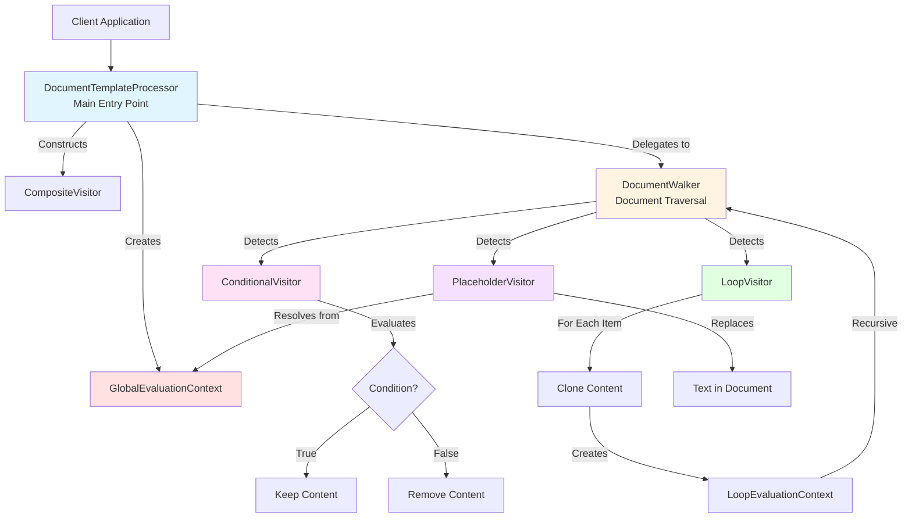
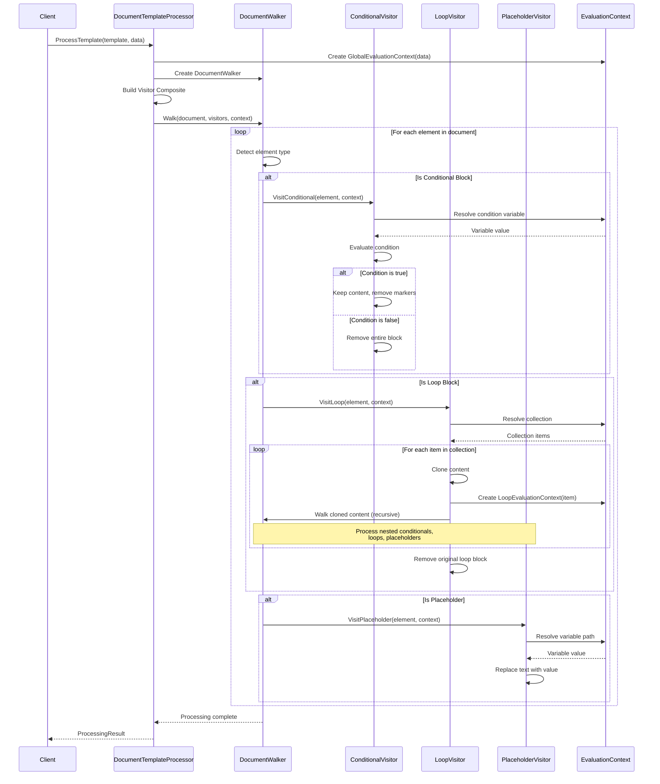
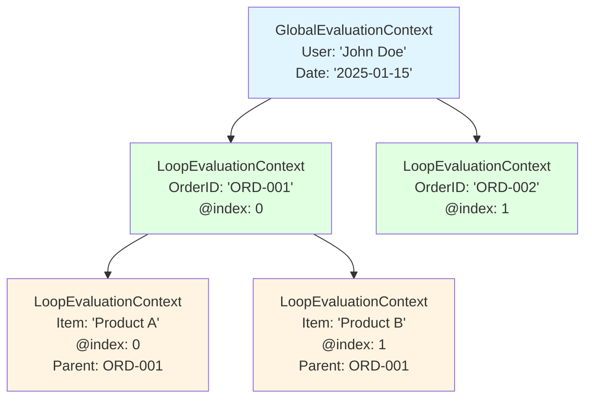

# Templify Architecture

**Last Updated**: 2025-11-09
**Current Version**: Post-Phase 2 Refactoring (Visitor Pattern)

## Current State (November 2025)

Templify now uses a **visitor pattern architecture** for processing Word document templates. This architecture was implemented as part of Phase 2 refactoring to enable:
- ✅ Conditionals inside loops
- ✅ Nested loops (arbitrary depth)
- ✅ Table row loops
- ✅ Clean, extensible architecture with no code duplication

**Key Changes from Original Architecture**:
- Unified visitor-based processing (replaced separate processor classes)
- Context-aware evaluation (IEvaluationContext) for proper variable scoping
- DocumentWalker for unified document traversal
- Composite visitor pattern for flexible feature composition

## Design Philosophy

Templify is intentionally designed to be **simple, focused, and maintainable**. This library provides the essential features most applications need: variable replacement, nested data structures, conditionals, and collection iteration, without the complexity of advanced templating engines.

### Design Principles

1. **Single Responsibility**: Each class has one clear purpose
2. **Composition over Inheritance**: Prefer small, composable classes
3. **Immutability**: Configuration objects are immutable after creation
4. **Fail-Fast**: Clear error messages, no silent failures
5. **Testability**: Pure functions and dependency injection where appropriate
6. **No Magic**: Explicit behavior, predictable results

## Current Architecture (Visitor Pattern - November 2025)

### High-Level Overview



#### Architecture Flow

The processing follows this sequence:

1. **Client** provides template and data
2. **DocumentTemplateProcessor** orchestrates the process
3. **DocumentWalker** traverses the document tree
4. **Visitors** process template elements in order: Conditionals → Loops → Placeholders
5. **EvaluationContext** provides variable resolution with proper scoping

### ASCII Diagram (Alternative View)

```
┌─────────────────────────────────────────────────────────────┐
│                    Client Application                        │
└────────────────────┬────────────────────────────────────────┘
                     │
                     ▼
┌─────────────────────────────────────────────────────────────┐
│              DocumentTemplateProcessor                       │
│           (Main Entry Point - Orchestration)                │
│  • Creates GlobalEvaluationContext                          │
│  • Constructs Visitor Composite                             │
│  • Delegates to DocumentWalker                              │
└────────────────────┬────────────────────────────────────────┘
                     │
                     ▼
┌─────────────────────────────────────────────────────────────┐
│                  DocumentWalker                              │
│            (Unified Document Traversal)                      │
│  • Walks document tree (body, tables, rows, cells)         │
│  • Detects template elements (conditionals, loops, placeholders)│
│  • Dispatches to appropriate visitors                       │
└───┬─────────────┬────────────────┬─────────────┬────────────┘
    │             │                │             │
    │ Conditional │  Loop          │ Placeholder │ Paragraph
    │ detected    │  detected      │ detected    │ (no template)
    │             │                │             │
    ▼             ▼                ▼             ▼
┌─────────────────────────────────────────────────────────────┐
│                  CompositeVisitor                            │
│            (Delegates to all visitors)                       │
└───┬─────────────┬────────────────┬─────────────────────────┘
    │             │                │
    ▼             ▼                ▼
┌────────────┐ ┌────────────┐ ┌────────────────────┐
│Conditional │ │LoopVisitor │ │PlaceholderVisitor  │
│Visitor     │ │            │ │                    │
│            │ │• Resolves  │ │• Resolves variables│
│• Evaluates │ │  collection│ │  from context      │
│  conditions│ │• Clones    │ │• Replaces text     │
│• Removes   │ │  content   │ │• Tracks count      │
│  branches  │ │• Creates   │ │                    │
│            │ │  LoopContext│ │                    │
│            │ │• Recursively│ │                    │
│            │ │  processes │ │                    │
│            │ │  with walker│ │                    │
└────────────┘ └────────────┘ └────────────────────┘
                      │
                      │ (nested processing)
                      ▼
┌────────────────────────────────────────────────────────┐
│            IEvaluationContext Hierarchy                 │
│  ┌──────────────────────────────────────────────────┐ │
│  │ GlobalEvaluationContext (root data)              │ │
│  │   ↑                                              │ │
│  │   └─ LoopEvaluationContext (loop item + parent) │ │
│  │        ↑                                         │ │
│  │        └─ LoopEvaluationContext (nested loop)   │ │
│  └──────────────────────────────────────────────────┘ │
│                                                        │
│  • Context-aware variable resolution                  │
│  • Hierarchical scoping (inner scopes shadow outer)  │
│  • Loop metadata (@index, @first, @last, @count)     │
└────────────────────────────────────────────────────────┘
```

### Visitor Pattern Flow

```
1. DocumentTemplateProcessor.ProcessTemplate()
   │
   ├─▶ Create GlobalEvaluationContext(data)
   │
   ├─▶ Create DocumentWalker
   │
   ├─▶ Create ConditionalVisitor, PlaceholderVisitor
   │
   ├─▶ Create tempComposite (conditional + placeholder)
   │
   ├─▶ Create tempLoopVisitor(walker, tempComposite)
   │
   ├─▶ Create finalComposite (conditional + tempLoop + placeholder)
   │
   ├─▶ Create loopVisitor(walker, finalComposite)  ← Can process nested loops!
   │
   ├─▶ Create composite (conditional + loop + placeholder)
   │
   └─▶ walker.Walk(document, composite, globalContext)
       │
       ├─▶ Walk body elements
       │   ├─▶ Step 1: Detect & visit conditionals (deepest first)
       │   ├─▶ Step 2: Detect & visit loops
       │   └─▶ Step 3: Visit paragraphs for placeholders
       │
       └─▶ Walk tables
           ├─▶ Step 1: Detect & visit table row loops
           └─▶ Step 2: Walk remaining rows/cells
               └─▶ (Recursive: detect conditionals, loops, placeholders)

2. When LoopVisitor processes a loop:
   │
   ├─▶ Resolve collection from context
   │
   ├─▶ For each item:
   │   ├─▶ Create LoopContext(item, index, count, parent)
   │   ├─▶ Create LoopEvaluationContext(loopContext, parentContext)
   │   ├─▶ Clone content elements
   │   ├─▶ Insert cloned elements into document
   │   └─▶ walker.WalkElements(clonedElements, nestedVisitor, loopEvalContext)
   │       │
   │       └─▶ Processes nested conditionals, loops, placeholders
   │           with loop-scoped variables!
   │
   └─▶ Remove original loop block (markers + content)
```

### Processing Sequence Diagram

Here's how a template with conditionals, loops, and placeholders is processed:



**Key Points**:
- Processing order: **Conditionals → Loops → Placeholders**
- Loop processing is **recursive** (enables nested loops)
- Each loop iteration creates a new **LoopEvaluationContext**
- Context hierarchy enables proper variable scoping

### Context Hierarchy Visualization



**Variable Resolution**:
- Inner contexts **shadow** outer contexts
- Special variables (`@index`, `@first`, `@last`, `@count`) are loop-specific
- Parent context accessible when variable not found in current scope

## Legacy Architecture (Pre-Phase 2 - Deprecated)

> **Note**: This architecture was used before November 2025 and is documented here for reference only.
> The current codebase uses the Visitor Pattern architecture described above.

```
┌─────────────────────────────────────────────────────────────┐
│                    Client Application                        │
└────────────────────┬────────────────────────────────────────┘
                     │
                     ▼
┌─────────────────────────────────────────────────────────────┐
│              DocumentTemplateProcessor                       │
│  (Main Entry Point - Orchestrates the process)              │
└────┬───────────┬──────────────┬──────────────┬──────────────┘
     │           │              │              │
     │           │              │              │
     ▼           ▼              ▼              ▼
┌─────────┐ ┌────────┐  ┌──────────┐  ┌────────────┐
│  Loop   │ │ Placeholder│DocumentBody││  Table     │
│ Detector│ │   Finder   │  Replacer  ││  Replacer  │
│         │ │            │            ││            │
│ - Find  │ │ - Find     │ - Replace  ││ - Replace  │
│   loops │ │   patterns │   in body  ││   in tables│
└────┬────┘ │ - Extract  │   paragraphs││           │
     │      │   names    │            ││            │
     ▼      └─────┬──────┘ └─────┬─────┘ └────┬─────┘
┌─────────┐      │              │            │
│  Loop   │      │              │            │
│Processor│      │              │            │
│         │      │              │            │
│ - Clone │◀─────┼──────────────┴────────────┘
│   content      │
│ - Create │     │
│   contexts│    │
└────┬────┘     │
     │          │
     ▼          ▼
┌──────────────────┐
│   ValueResolver  │
│PropertyPathResolver│
│                  │
│ - Nested paths  │
│ - Collections   │
│ - Dictionaries  │
└────────┬─────────┘
         │
         ▼
┌────────────────────┐
│  OpenXML SDK API   │
│  WordprocessingML  │
└────────────────────┘
```

## Core Components

### 1. DocumentTemplateProcessor

**Purpose**: Main entry point and orchestrator

**Responsibilities**:
- Accept template stream, output stream, and data
- Open WordprocessingDocument safely
- Coordinate PlaceholderFinder and replacers
- Aggregate results and errors
- Ensure proper resource disposal

**Key Methods**:
```csharp
ProcessingResult ProcessTemplate(
    Stream templateStream,
    Stream outputStream,
    Dictionary<string, object> data)
```

**Design Notes**:
- Uses `using` statements for proper resource management
- Copies template to output before processing (non-destructive)
- Catches and wraps exceptions in ProcessingResult

### 2. PlaceholderFinder

**Purpose**: Locate and extract placeholder patterns

**Responsibilities**:
- Search text for `{{variableName}}` patterns
- Extract variable names
- Validate placeholder syntax
- Return placeholder locations

**Key Methods**:
```csharp
IEnumerable<PlaceholderMatch> FindPlaceholders(string text)
bool IsValidPlaceholder(string text)
string ExtractVariableName(string placeholder)
```

**Design Notes**:
- Uses regular expressions for pattern matching: `\{\{(\w+)\}\}`
- Immutable result objects
- No state, can be reused safely

### 3. DocumentBodyReplacer

**Purpose**: Replace placeholders in document body paragraphs

**Responsibilities**:
- Iterate through body paragraphs
- Find and replace text in runs
- Handle text spanning multiple runs
- Track replacement count

**Key Methods**:
```csharp
int ReplaceInBody(
    WordprocessingDocument document,
    Dictionary<string, object> data,
    PlaceholderReplacementOptions options)
```

**Design Notes**:
- Works with OpenXML `Paragraph` and `Run` elements
- Handles the complexity of text being split across multiple runs
- Returns count of replacements made

### 4. TableReplacer

**Purpose**: Replace placeholders in table cells

**Responsibilities**:
- Iterate through all tables
- Process each cell's paragraphs
- Delegate to body replacer logic for cell content
- Track replacement count

**Key Methods**:
```csharp
int ReplaceInTables(
    WordprocessingDocument document,
    Dictionary<string, object> data,
    PlaceholderReplacementOptions options)
```

**Design Notes**:
- Reuses paragraph processing logic from DocumentBodyReplacer
- Handles nested tables
- Processes cells left-to-right, top-to-bottom

### 5. LoopDetector

**Purpose**: Detect and parse loop blocks in documents

**Responsibilities**:
- Find `{{#foreach CollectionName}}` markers
- Find matching `{{/foreach}}` end markers
- Handle nested loops (track nesting depth)
- Extract collection names
- Build LoopBlock structures

**Key Methods**:
```csharp
IReadOnlyList<LoopBlock> DetectLoops(WordprocessingDocument document)
```

**Design Notes**:
- Static utility class
- Uses regex patterns for marker detection
- Properly handles nested foreach blocks by tracking depth
- Returns loop blocks in document order

### 6. LoopBlock

**Purpose**: Represent a parsed loop structure

**Properties**:
```csharp
string CollectionName { get; }
IReadOnlyList<OpenXmlElement> ContentElements { get; }
OpenXmlElement StartMarker { get; }
OpenXmlElement EndMarker { get; }
bool IsTableRowLoop { get; }
LoopBlock? EmptyBlock { get; }
```

**Design Notes**:
- Immutable data structure
- Contains references to OpenXML elements to be cloned
- Supports both paragraph and table row loops

### 7. LoopProcessor

**Purpose**: Execute loop blocks by cloning content

**Responsibilities**:
- Resolve collection from data dictionary
- Create LoopContext for each item
- Clone content elements for each iteration
- Process placeholders in cloned content
- Remove loop markers after processing
- Handle empty collections

**Key Methods**:
```csharp
int ProcessLoops(
    IReadOnlyList<LoopBlock> loops,
    Dictionary<string, object> data,
    List<string> missingVariables)
```

**Design Notes**:
- Processes loops before simple placeholder replacement
- Uses ValueResolver for collection lookup
- Clones OpenXML elements (deep copy)
- Handles nested loops through context chaining

### 8. LoopContext

**Purpose**: Maintain loop iteration state

**Properties**:
```csharp
object CurrentItem { get; }
int Index { get; }
int Count { get; }
string CollectionName { get; }
LoopContext? Parent { get; }
bool IsFirst { get; }
bool IsLast { get; }
```

**Key Methods**:
```csharp
static IReadOnlyList<LoopContext> CreateContexts(
    IEnumerable collection,
    string collectionName,
    LoopContext? parent)

bool TryResolveVariable(string variableName, out object? value)
```

**Design Notes**:
- Immutable context per iteration
- Supports nested loops via Parent reference
- Resolves variables from current item first, then parent contexts
- Handles metadata variables (@index, @first, @last, @count)

### 9. PropertyPath & PropertyPathResolver

**Purpose**: Navigate nested data structures

**Responsibilities**:
- Parse property paths with mixed notation (dots and brackets)
- Navigate through objects, collections, and dictionaries
- Resolve nested properties using reflection

**Key Methods**:
```csharp
PropertyPath Parse(string path)
object? ResolvePath(object? root, PropertyPath path)
```

**Design Notes**:
- Supports dot notation: `Customer.Address.City`
- Supports array indexing: `Items[0]`
- Supports dictionary access: `Settings[Theme]`
- Static methods for efficiency
- Null-safe traversal

### 10. ValueResolver

**Purpose**: Centralized value lookup from data dictionary

**Responsibilities**:
- Check direct dictionary keys first (fast path)
- Parse and resolve nested property paths
- Handle both simple and complex data access patterns

**Key Methods**:
```csharp
bool TryResolveValue(
    Dictionary<string, object> data,
    string variablePath,
    out object? value)
```

**Design Notes**:
- Fast path for direct dictionary lookups
- Backward compatible with simple keys
- Uses PropertyPathResolver for nested paths

### 11. FormattingPreserver

**Purpose**: Preserve and apply text formatting (character and paragraph styles)

**Responsibilities**:
- Extract RunProperties from original runs
- Clone RunProperties for reuse
- Apply RunProperties to new runs
- Ensure formatting is preserved during text replacement

**Key Methods**:
```csharp
static RunProperties? ExtractRunProperties(IEnumerable<Run> runs)
static RunProperties? CloneRunProperties(RunProperties? originalProperties)
static void ApplyRunProperties(Run run, RunProperties? properties)
static RunProperties? ExtractAndCloneRunProperties(IEnumerable<Run> runs)
```

**Design Notes**:
- Static utility class for formatting operations
- Extracts properties from first run that has any
- Uses deep cloning to avoid reference issues
- Preserves all character formatting: bold, italic, font, color, size, underline, etc.
- Works with both DocumentBodyReplacer and LoopProcessor

**Formatting Flow**:
```
1. Before removing runs:
   - Extract RunProperties from first run
   - Clone properties (deep copy)

2. Create new run with replacement text

3. Apply cloned properties to new run
   - Formatting is preserved
   - Replacement inherits placeholder's style
```

### 12. ValueConverter

**Purpose**: Convert various .NET types to string representations

**Responsibilities**:
- Convert objects to strings for document output
- Handle null values
- Format numbers, dates, booleans appropriately

**Design Notes**:
- Static utility class
- Uses ToString() for most types
- Culture-aware formatting

### 13. PlaceholderReplacementOptions

**Purpose**: Configuration object for template processing

**Properties**:
```csharp
MissingVariableBehavior MissingVariableBehavior { get; init; }
```

**Design Notes**:
- Immutable (init-only properties)
- Provides sensible defaults
- Can be extended with additional options in future

### 6. ProcessingResult

**Purpose**: Encapsulate processing outcome and metrics

**Properties**:
```csharp
bool IsSuccess { get; init; }
int ReplacementCount { get; init; }
string? ErrorMessage { get; init; }
IReadOnlyList<string> MissingVariables { get; init; }
```

**Design Notes**:
- Immutable result object
- Combines success/failure with metrics
- Enables detailed error reporting

## Enumerations

### MissingVariableBehavior

Defines how to handle placeholders without corresponding data:

```csharp
public enum MissingVariableBehavior
{
    LeaveUnchanged,  // Keep {{placeholder}} in document
    ReplaceWithEmpty, // Remove placeholder (replace with "")
    ThrowException    // Fail fast with exception
}
```

## Processing Flow

```
1. Client calls ProcessTemplate()
   │
   ▼
2. DocumentTemplateProcessor copies template to output stream
   │
   ▼
3. Open WordprocessingDocument for editing
   │
   ▼
4. LoopDetector scans for {{#foreach}}...{{/foreach}} blocks
   │
   ├─▶ Find all loop start/end markers
   │
   ├─▶ Build LoopBlock structures with content elements
   │
   └─▶ Handle nested loops (track depth)
   │
   ▼
5. LoopProcessor executes each loop
   │
   ├─▶ Resolve collection from data dictionary
   │
   ├─▶ Create LoopContext for each item
   │
   ├─▶ Clone content elements for each iteration
   │   │
   │   └─▶ Process placeholders in cloned content
   │       │
   │       ├─▶ Try resolve from LoopContext (current item + metadata)
   │       │
   │       └─▶ Fallback to root data dictionary
   │
   └─▶ Remove loop markers and original content
   │
   ▼
6. DocumentBodyReplacer processes remaining placeholders in body
   │
   ├─▶ PlaceholderFinder identifies {{variables}}
   │
   ├─▶ ValueResolver looks up values (nested path support)
   │
   └─▶ Replace text in runs with data values
   │
   ▼
7. TableReplacer processes remaining placeholders in tables
   │
   ├─▶ For each table cell
   │   │
   │   ├─▶ PlaceholderFinder identifies {{variables}}
   │   │
   │   ├─▶ ValueResolver looks up values
   │   │
       │   └─▶ Replace text in runs with data values
       │
       └─▶ Handle nested tables recursively
   │
   ▼
5. Save document
   │
   ▼
6. Return ProcessingResult with metrics
```

## Text Replacement Strategy

### Challenge: Text Spans Multiple Runs

OpenXML splits text into `Run` elements for formatting. A placeholder like `{{CompanyName}}` might be split as:

```xml
<w:p>
  <w:r><w:t>{{Company</w:t></w:r>
  <w:r><w:t>Name}}</w:t></w:r>
</w:p>
```

### Solution: Paragraph-Level Processing

1. **Concatenate**: Combine all run texts in a paragraph
2. **Find**: Locate placeholders in combined text
3. **Replace**: Perform string replacement
4. **Reconstruct**: Create new runs with replaced text
5. **Preserve**: Maintain original formatting of first run

This approach trades some formatting complexity for correctness.

### Per-Run Optimization (December 2025)

When a placeholder is entirely contained within a single run, the library uses an optimized
per-run replacement strategy that preserves the run's complete formatting:

```
Multi-run case (placeholder spans runs):
  [Run1: "{{Na"] [Run2: "me}}"]  →  Merge all runs, use first run's formatting

Single-run case (placeholder within one run):
  [Run: "C{{Value}}"]  →  Replace in-place, preserve ALL run formatting
```

**Why this matters**: The multi-run merge approach extracts formatting from the first run,
which can lose certain properties like highlight colors and shading that are specific to
individual runs. The per-run optimization preserves:

- Highlight colors (yellow, cyan, etc.)
- Background shading (Shading element with Fill)
- All other RunProperties (bold, italic, color, font, etc.)

**Implementation** (`PlaceholderVisitor.cs`):
1. `BuildRunBoundaries()` - Maps character indices to runs
2. `FindRunsForPlaceholder()` - Detects if placeholder spans single or multiple runs
3. `ReplacePlaceholderInSingleRun()` - Updates run text in-place, preserving formatting
4. `ReplaceRunText()` - Simple text replacement while keeping RunProperties

This optimization is transparent to users and automatically applies when placeholders
are not split across multiple runs (the common case in well-formed templates).

## Value Conversion Strategy

```csharp
object value → string representation

- string         → as-is
- null           → "" or error (based on options)
- DateTime       → culture-specific format
- numbers        → culture-specific format
- bool           → "True" / "False"
- other          → ToString()
```

## Error Handling Strategy

### Levels of Error Handling:

1. **Invalid Placeholder Syntax**: Ignored (treated as regular text)
2. **Missing Variable**: Configurable (options)
3. **File/Stream Errors**: Thrown immediately
4. **OpenXML Errors**: Caught, wrapped in ProcessingResult

### Philosophy:

- **Fail Fast**: Don't silently corrupt documents
- **Clear Messages**: Specific error descriptions
- **Graceful Degradation**: Return partial results when possible
- **No Silent Failures**: Always communicate what happened

## Comparison to OpenXMLTemplates V1

| Aspect | V1 (Original) | V2 (This Library) |
|--------|---------------|-------------------|
| **Approach** | Content Controls | Text Replacement |
| **Complexity** | High (25+ files) | Low (6 core classes) |
| **Features** | Loops, conditionals, images | Variable replacement only |
| **Learning Curve** | Steep | Minimal |
| **Template Setup** | Must use content controls | Just type `{{variable}}` |
| **Designer Friendly** | Requires training | Intuitive |
| **Use Case** | Complex documents | Simple variable replacement |
| **Target** | .NET Standard 2.0 | .NET 9.0 |
| **Pattern** | Strategy + Chain of Responsibility | Direct processing |

## Extension Points

While the MVP is intentionally limited, the architecture supports future extensions:

### 1. Additional Replacers
Create new replacer classes for:
- Headers/Footers
- Text boxes
- Footnotes
- Custom XML parts

### 2. Value Formatters
Add custom formatting strategies:
```csharp
options.AddFormatter<DateTime>(dt => dt.ToString("yyyy-MM-dd"));
options.AddFormatter<decimal>(d => d.ToString("C2", culture));
```

### 3. Placeholder Validation
Add validation hooks:
```csharp
options.OnPlaceholderFound += (placeholder) => ValidateAgainstSchema(placeholder);
```

### 4. Custom Placeholder Syntax
Support alternative patterns:
```csharp
options.PlaceholderPattern = new Regex(@"\[\[(\w+)\]\]"); // Use [[variable]]
```

## Performance Considerations

### Current Design Trade-offs:

1. **Memory**: Loads entire document into memory
   - **Pro**: Simple, reliable
   - **Con**: Not suitable for very large documents (>50MB)

2. **Text Reconstruction**: Rebuilds paragraph runs
   - **Pro**: Guarantees correct replacement
   - **Con**: May lose some complex formatting

3. **Linear Search**: O(n) through all paragraphs and tables
   - **Pro**: Simple, predictable
   - **Con**: Slower for documents with thousands of placeholders

### Future Optimizations (if needed):

- Parallel processing of independent tables
- Streaming API for large documents
- Placeholder caching for repeated templates
- Lazy evaluation of value conversions

## Testing Strategy

### Unit Tests

- **PlaceholderFinder**: Pattern matching, edge cases
- **Value Conversion**: All data types
- **Error Handling**: All error scenarios
- **Options**: Each MissingVariableBehavior mode

### Integration Tests

- **Real Documents**: Process actual .docx files
- **Complex Tables**: Nested tables, merged cells
- **Formatting Preservation**: Bold, italic, colors
- **Large Documents**: Performance benchmarks

## Dependencies

- **DocumentFormat.OpenXml** (3.3.0+)
  - Used for: Reading/writing Word documents
  - License: MIT
  - Stable, well-maintained by Microsoft

- **.NET 9.0**
  - Modern C# features (init-only properties, records, file-scoped namespaces)
  - Performance improvements
  - Enhanced nullable reference types

## Future Considerations

### Potential Features (Not in MVP):

1. **Conditional Content**: `{{if IsApproved}}...{{/if}}`
2. **Loops**: `{{each Items}}...{{/each}}`
3. **Nested Objects**: `{{Customer.Address.City}}`
4. **Image Replacement**: `{{image:LogoPath}}`
5. **Calculated Fields**: `{{Amount * Tax}}`
6. **Localization**: Culture-specific formatting rules
7. **Template Validation**: Pre-flight checks before processing

### Migration Path:

If complex features are needed, consider:
- Using this library for simple cases
- Using OpenXMLTemplates V1 for complex scenarios
- Or gradually extending V2 with new replacer strategies

## Conclusion

Templify prioritizes **simplicity** and **maintainability** over feature completeness. By focusing on the most common use case (variable replacement), we achieve:

- Easy to understand and modify
- Quick to test and debug
- Low barrier to entry for new developers
- Predictable behavior
- Minimal dependencies

For complex templating needs, the original OpenXMLTemplates library remains available.
