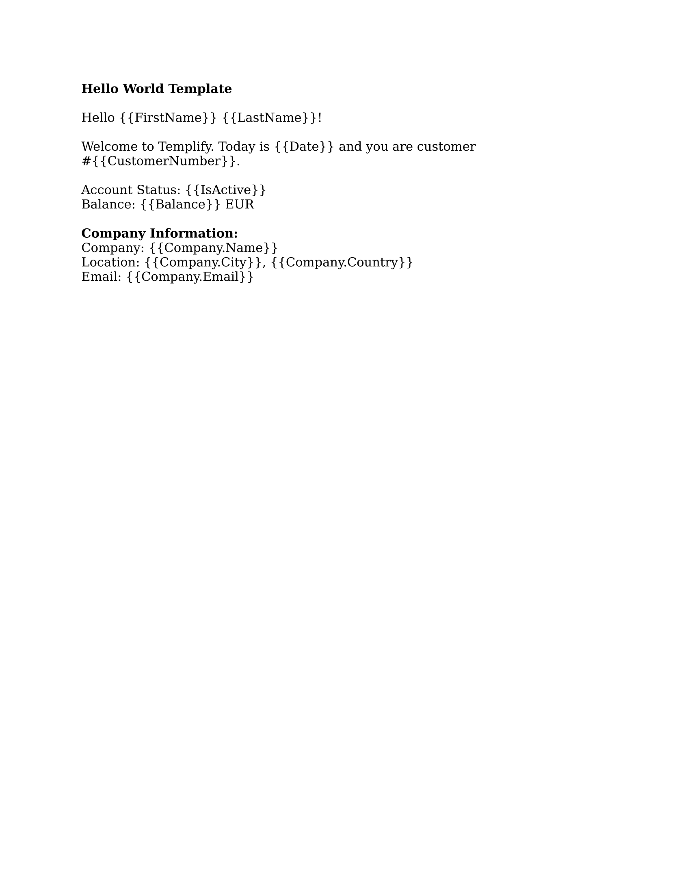
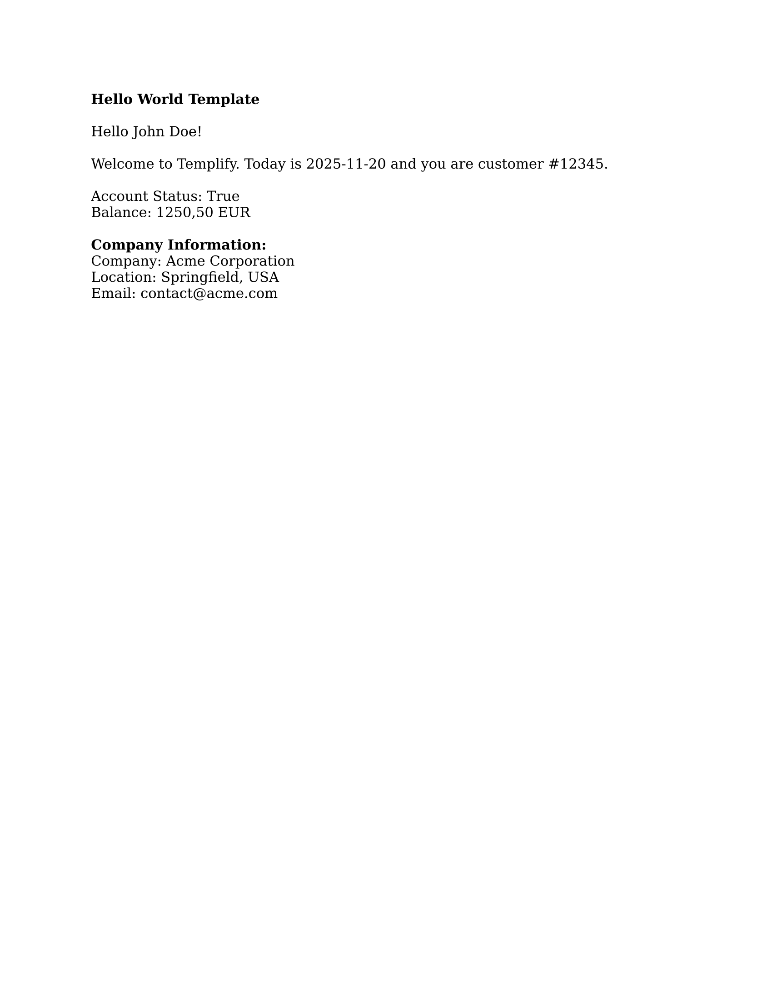

> Historical document, not maintained. Kept for reference only; it does not describe the current state of Templify.

# Documentation Example System

This document describes the automated system for generating example documents and images for Templify documentation.

## Overview

We've built a complete pipeline that:
1. **Generates example .docx templates** with Templify syntax using OpenXML SDK
2. **Processes templates with Templify** to create output documents
3. **Converts to PNG images** via Stirling-PDF for documentation

## System Architecture

```
┌─────────────────────────────────────────────────────────────┐
│                 DocumentGenerator CLI Tool                   │
│                 (TriasDev.Templify.DocumentGenerator)        │
└─────────────────────────────────────────────────────────────┘
                           │
           ┌───────────────┼───────────────┐
           │               │               │
           ▼               ▼               ▼
    ┌──────────┐   ┌──────────┐   ┌──────────┐
    │  Hello   │   │ Invoice  │   │Condition-│
    │  World   │   │Generator │   │   als    │
    │Generator │   │          │   │Generator │
    └──────────┘   └──────────┘   └──────────┘
           │               │               │
           └───────────────┼───────────────┘
                           │
                           ▼
                 ┌─────────────────┐
                 │  Templify Core  │
                 │  (Processing)   │
                 └─────────────────┘
                           │
                           ▼
                  ┌────────────────┐
                  │ Stirling-PDF   │
                  │   Converter    │
                  │ (DOCX→PNG)     │
                  └────────────────┘
                           │
                           ▼
                 ┌─────────────────┐
                 │  DocFX Images   │
                 │  Directory      │
                 └─────────────────┘
```

## Directory Structure

```
templify/
├── .env                                    # Config (gitignored)
├── .env.example                            # Config template
│
├── TriasDev.Templify.DocumentGenerator/   # Generator project
│   ├── Program.cs                          # CLI entry point
│   ├── StirlingPdfConverter.cs             # PDF conversion
│   ├── IExampleGenerator.cs                # Generator interface
│   ├── BaseExampleGenerator.cs             # Base class
│   ├── Generators/
│   │   ├── HelloWorldGenerator.cs
│   │   ├── InvoiceGenerator.cs
│   │   └── ConditionalGenerator.cs
│   └── README.md                           # Full documentation
│
├── examples/
│   ├── templates/                          # Generated templates
│   │   ├── hello-world-template.docx
│   │   ├── invoice-template.docx
│   │   └── conditionals-template.docx
│   └── outputs/                            # Processed outputs
│       ├── hello-world-output.docx
│       ├── invoice-output.docx
│       └── conditionals-output.docx
│
└── docs/images/examples/
    ├── templates/                          # Template screenshots
    │   ├── hello-world-template.png
    │   ├── invoice-template.png
    │   └── conditionals-template.png
    └── outputs/                            # Output screenshots
        ├── hello-world-output.png
        ├── invoice-output.png
        └── conditionals-output.png
```

## Usage

### One-Command Generation

```bash
# Generate everything (documents + images)
dotnet run --project TriasDev.Templify.DocumentGenerator
```

### Output

```
Templify Documentation Example Generator
=========================================

Generating all examples...

[hello-world]
  Description: Simple placeholder replacement with text and numbers
  Generating template... ✓ hello-world-template.docx
  Processing with Templify... ✓ Processed template: 10 placeholders replaced
✓ hello-world-output.docx

[invoice]
  Description: Invoice with table loops, line items, and calculations
  Generating template... ✓ invoice-template.docx
  Processing with Templify... ✓ Processed template: 31 placeholders replaced
✓ invoice-output.docx

[conditionals]
  Description: Conditional blocks with if/else logic and boolean expressions
  Generating template... ✓ conditionals-template.docx
  Processing with Templify... ✓ Processed template: 10 placeholders replaced
✓ conditionals-output.docx

✓ Generated 3 examples successfully!

=========================================
Converting to Images
=========================================

Testing connection to Stirling-PDF: https://stirling-pdf.staging.vias.pro
✓ Connected to Stirling-PDF

Converting templates...
  invoice-template.docx → ✓ invoice-template.png
  conditionals-template.docx → ✓ conditionals-template.png
  hello-world-template.docx → ✓ hello-world-template.png
  Converted: 3/3

Converting outputs...
  hello-world-output.docx → ✓ hello-world-output.png
  conditionals-output.docx → ✓ conditionals-output.png
  invoice-output.docx → ✓ invoice-output.png
  Converted: 3/3

=========================================
Summary
=========================================

Generated Documents:
  Templates: 3 files
  Outputs:   3 files

Generated Images:
  Templates: 3 images
  Outputs:   3 images

📍 Location:
  Documents: /path/to/examples/templates
  Images:    /path/to/docs/images/examples

💡 Usage in documentation:
  
  

✓ All done!
```

## Configuration

### Environment Variables (.env)

```env
# Stirling-PDF Configuration
STIRLING_PDF_URL=https://stirling-pdf.staging.vias.pro
STIRLING_PDF_API_KEY=your-api-key-here
```

### Security

- `.env` is added to `.gitignore` (never committed)
- `.env.example` serves as a template (safe to commit)
- API keys remain local to each developer

## Example Generators

### 1. HelloWorldGenerator
- **Features**: Simple placeholders, nested data, basic types
- **Use Case**: Introduction tutorial
- **Complexity**: Beginner

### 2. InvoiceGenerator
- **Features**: Table loops, multiple sections, realistic structure
- **Use Case**: Advanced tutorial, real-world example
- **Complexity**: Intermediate

### 3. ConditionalGenerator
- **Features**: If/else blocks, boolean expressions, nested conditionals
- **Use Case**: Conditional logic tutorial
- **Complexity**: Intermediate

## Adding New Examples

1. **Create Generator Class**:
   ```csharp
   public class MyExampleGenerator : BaseExampleGenerator
   {
       public override string Name => "my-example";
       public override string Description => "Description here";

       public override string GenerateTemplate(string outputDir) { /* ... */ }
       public override Dictionary<string, object> GetSampleData() { /* ... */ }
   }
   ```

2. **Register in Program.cs**:
   ```csharp
   var generators = new List<IExampleGenerator>
   {
       new HelloWorldGenerator(),
       new InvoiceGenerator(),
       new ConditionalGenerator(),
       new MyExampleGenerator(),  // Add here
   };
   ```

3. **Run**:
   ```bash
   dotnet run --project TriasDev.Templify.DocumentGenerator -- my-example
   ```

## Using in Documentation

### Markdown Example

```markdown
## Hello World Example

This example demonstrates basic placeholder replacement.

**Template Structure:**


**Processed Output:**


**Template Code:**
```
Hello {{FirstName}} {{LastName}}!
Welcome to Templify.
Company: {{Company.Name}}
Location: {{Company.City}}, {{Company.Country}}
```

**Sample Data:**
```csharp
var data = new Dictionary<string, object>
{
    ["FirstName"] = "John",
    ["LastName"] = "Doe",
    ["Company"] = new Dictionary<string, object>
    {
        ["Name"] = "Acme Corporation",
        ["City"] = "Springfield",
        ["Country"] = "USA"
    }
};
```
\```

## Benefits

### For Developers

✅ **Single Command**: Generate everything with one command
✅ **Cross-Platform**: Pure C#, works on Windows/macOS/Linux
✅ **Type-Safe**: Compile-time checking for generator code
✅ **Extensible**: Easy to add new examples
✅ **Consistent**: Same quality across all examples

### For Documentation

✅ **Visual**: Actual screenshots of documents
✅ **Accurate**: Examples always match current code
✅ **Up-to-Date**: Regenerate when features change
✅ **Versioned**: Images committed to repo
✅ **Reproducible**: Generated from code, not manual

### For Users

✅ **Downloadable**: .docx templates available
✅ **Real Examples**: Not mock-ups or illustrations
✅ **Working Code**: Sample data provided
✅ **Clear**: See both template and output

## Technical Details

### Stirling-PDF Integration

The system uses Stirling-PDF's REST API:

1. **DOCX → PDF**: `POST /api/v1/convert/file/pdf`
2. **PDF → PNG**: `POST /api/v1/convert/pdf/img`

Parameters:
- DPI: 200 (configurable)
- Color: RGB
- Format: PNG
- Page: First page only

### OpenXML Document Generation

Templates are created programmatically using DocumentFormat.OpenXML:

```csharp
using var doc = WordprocessingDocument.Create(path, WordprocessingDocumentType.Document);
var mainPart = doc.AddMainDocumentPart();
mainPart.Document = new Document();
var body = new Body();

var paragraph = new Paragraph();
var run = new Run(new Text("{{Placeholder}}"));
paragraph.Append(run);
body.Append(paragraph);

mainPart.Document.Append(body);
doc.Save();
```

### Template Processing

Templify's `DocumentTemplateProcessor` processes templates:

```csharp
var processor = new DocumentTemplateProcessor();
using var templateStream = File.OpenRead(templatePath);
using var outputStream = File.Create(outputPath);

var result = processor.ProcessTemplate(templateStream, outputStream, data);
```

## Performance

| Operation | Time | Notes |
|-----------|------|-------|
| Document Generation | < 1s | Per example |
| Templify Processing | < 1s | Per document |
| Image Conversion | 2-5s | Per document (network dependent) |
| **Total (3 examples)** | **20-30s** | All documents + images |

## Troubleshooting

### Connection Issues

**Problem**: Cannot connect to Stirling-PDF

**Solutions**:
1. Verify URL in `.env`
2. Check Stirling-PDF is running
3. Test with: `curl https://your-url`
4. Verify API key

### Skip Images

Run with `--skip-images` flag if Stirling-PDF is unavailable:

```bash
dotnet run --project TriasDev.Templify.DocumentGenerator -- --skip-images
```

## Future Enhancements

Potential additions:
- [ ] Multiple page captures
- [ ] Crop/resize options
- [ ] Comparison view (before/after side-by-side)
- [ ] Video generation (animated GIFs)
- [ ] HTML output (interactive examples)
- [ ] Batch processing optimizations
- [ ] Parallel image conversion

## Related Documentation

- **[DocumentGenerator README](TriasDev.Templify.DocumentGenerator/README.md)** - Full tool documentation
- **[Scripts README](scripts/README.md)** - Legacy bash/cmd scripts (deprecated)
- **[Examples](TriasDev.Templify/Examples.md)** - Code examples
- **[CLAUDE.md](CLAUDE.md)** - Developer guide

## Summary

This system provides a complete, automated solution for maintaining documentation examples. By generating examples programmatically, we ensure they're always accurate, up-to-date, and consistent with the current version of Templify.

The C# implementation offers:
- Cross-platform compatibility
- Type safety
- Easy extensibility
- Single-command operation
- Reliable, reproducible results

Perfect for maintaining high-quality documentation with minimal manual effort!
