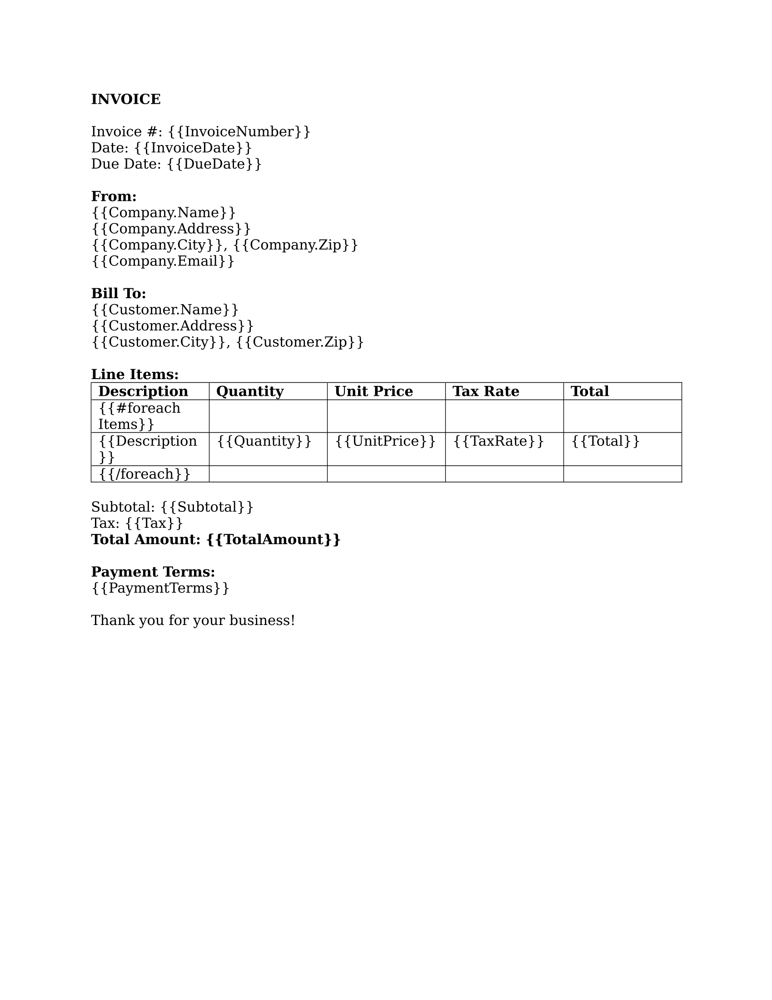
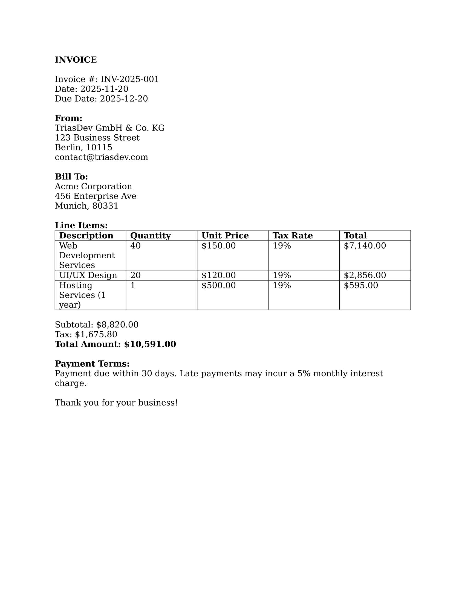
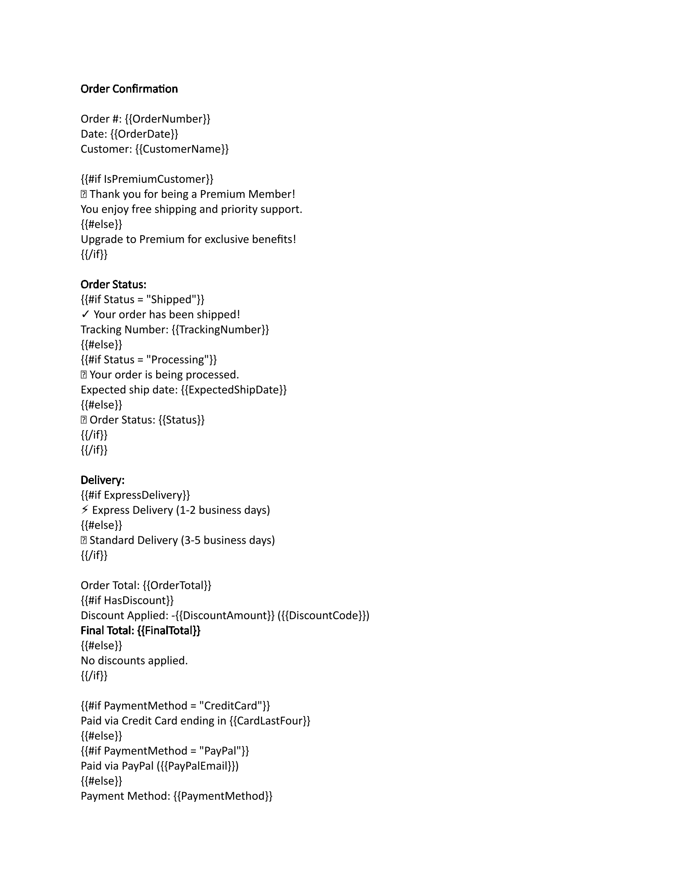
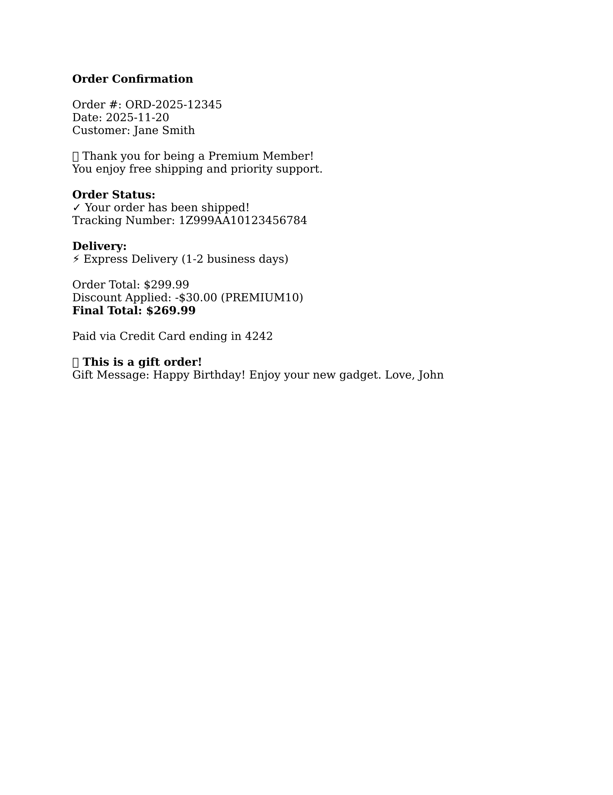

# Examples Gallery

Explore real-world Templify templates with visual examples. Each example includes the template image, sample JSON data, and the resulting output.

## Available Examples

### 1. Hello World

**Description:** A simple introduction template demonstrating basic placeholder replacement.

**Features:**
- Simple placeholders
- Text replacement

**Template:**

**Output:**

**Download:**
- [hello-world-template.docx](https://github.com/TriasDev/templify/raw/main/examples/templates/hello-world-template.docx) - The Word template file
- [hello-world-output.docx](https://github.com/TriasDev/templify/raw/main/examples/outputs/hello-world-output.docx) - The processed result

---

### 2. Invoice Generator

**Description:** A professional invoice template with line items, calculations, and customer information.

**Features:**
- Nested properties (Customer.Name, Customer.Address)
- Table row loops for line items
- Number formatting
- Conditional sections

**Template:**

**Output:**

**Download:**
- [invoice-template.docx](https://github.com/TriasDev/templify/raw/main/examples/templates/invoice-template.docx) - The Word template file
- [invoice-output.docx](https://github.com/TriasDev/templify/raw/main/examples/outputs/invoice-output.docx) - The processed result

---

### 3. Conditional Content

**Description:** Demonstrates conditional sections that show/hide based on data values.

**Features:**
- If/else conditionals
- Boolean flags
- Status-based messaging
- Multiple conditional sections

**Template:**

**Output:**

**Download:**
- [conditionals-template.docx](https://github.com/TriasDev/templify/raw/main/examples/templates/conditionals-template.docx) - The Word template file
- [conditionals-output.docx](https://github.com/TriasDev/templify/raw/main/examples/outputs/conditionals-output.docx) - The processed result

More templates (advanced conditionals, warning report) are in the [examples folder](https://github.com/TriasDev/templify/tree/main/examples) of the repository. The sample data for each example is defined in the [DocumentGenerator](https://github.com/TriasDev/templify/tree/main/TriasDev.Templify.DocumentGenerator) tool that produces these files.

---

## More Examples Coming Soon!

We're working on adding more examples covering:

- **Nested Loops** - Departments with employees
- **Report Card** - Student grades with loops and conditionals
- **Certificate** - Formal document with formatting
- **Meeting Notes** - Attendees list with roles
- **Product Catalog** - Categories with product listings
- **Contract Template** - Terms and conditions with optional clauses

## Using These Examples

### Try Them Yourself

1. Download the template file (.docx)
2. Write a JSON file with matching data (see the output file for the values used)
3. Process the template using:
   - **GUI Application:** Open Templify GUI, select the template and JSON file, then click **Process Template**
   - **Demo app (from the source code):** `dotnet run --project TriasDev.Templify.Demo -- --template template.docx --data data.json --output output.docx`

### Modify for Your Needs

Each example template can be customized:

1. Open the template in Microsoft Word
2. Modify the placeholders, add new sections, change formatting
3. Update the JSON data to match your changes
4. Process and see your customized output!

## Tips for Learning

### Start Simple

Begin with the Hello World example to understand basic placeholders, then move to more complex examples.

### Study the JSON Structure

Look at how the JSON data is structured and how it maps to the template placeholders. This will help you understand the dot notation (`Customer.Name`) and arrays.

### Experiment

- Change values in the JSON to see how the output changes
- Add new placeholders to the template
- Try removing conditional sections
- Add more items to loops

### Check the Output

Always compare the template to the output to see exactly what Templify does. This helps you understand:
- Where data gets inserted
- How loops repeat content
- When conditionals show/hide sections

## Need Help?

If you have questions about these examples:

- **[Getting Started Guide](getting-started.md)** - Basic template creation tutorial
- **[Template Syntax Reference](template-syntax.md)** - Complete syntax guide
- **[Best Practices](best-practices.md)** - Tips for creating good templates
- **[FAQ](../FAQ.md)** - Common questions and answers

## Contribute Your Examples

Do you have a great template example? We'd love to include it! Check out our [Contributing Guide](https://github.com/TriasDev/templify/blob/main/CONTRIBUTING.md) to learn how to submit your examples.

---

*Examples are automatically generated using the Templify DocumentGenerator tool to ensure they stay up-to-date with the latest features.*
